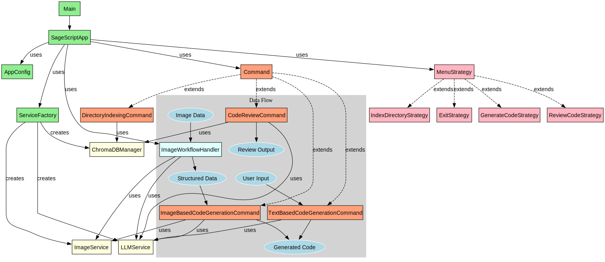

# SageScript 🧙‍♂️

A powerful local code assistant powered by Ollama that helps you understand and work with your codebase more effectively. The application follows SOLID principles and implements several design patterns for maintainability and extensibility.

## 🌟 Features

- **Local Code Context**: Processes and understands your entire codebase to provide contextually relevant responses
- **Powered by Ollama**: Uses the stable-code:3b model for code generation and understanding
- **RAG Implementation**: Utilizes ChromaDB for efficient code indexing and retrieval
- **Rich CLI Interface**: Interactive command-line interface with beautiful formatting and progress indicators
- **Code Generation**: Generates code snippets based on your queries and codebase context
- **Image-to-Code**: Extract structured data from images and generate code from it
- **Code Review**: Analyze code against bad practices and provide improvement suggestions
- **File Management**: Option to save generated code directly to files
- **SOLID Architecture**: Follows SOLID principles for maintainable and extensible code
- **Design Patterns**: Implements Factory, Strategy, Command, and Dependency Injection patterns

## 🚀 Getting Started

### Prerequisites

- Python 3.8+
- Ollama installed with stable-code:3b model
- JigsawStack API key for image processing

### Installation

1. Clone the repository:
```bash
git clone https://github.com/yourusername/SageScript.git
cd SageScript
```

2. Install dependencies:
```bash
pip install -r requirements.txt
```

3. Make sure Ollama is running with the required model:
```bash
ollama pull stable-code:3b
```

4. Update the JigsawStack API key in the `AppConfig` class in `main.py`

## 💻 Usage

1. Run the application:
```bash
python main.py
```

2. Choose from the main menu options:
   - Generate Code (from text or image)
   - Review a Code File
   - Index a Directory
   - Exit

## 🏗️ Architecture

The application follows SOLID principles and implements several design patterns:

- **Single Responsibility Principle**: Each class has a single responsibility
- **Open/Closed Principle**: The application is open for extension but closed for modification
- **Liskov Substitution Principle**: Derived classes can be substituted for their base classes
- **Interface Segregation Principle**: Clients are not forced to depend on interfaces they don't use
- **Dependency Inversion Principle**: High-level modules depend on abstractions, not low-level modules

### Design Patterns

- **Factory Pattern**: `ServiceFactory` creates service instances
- **Strategy Pattern**: Menu options are implemented as strategies
- **Command Pattern**: Workflows are implemented as commands
- **Dependency Injection**: Services are injected into classes that need them

### Flow Diagram

The following diagram illustrates the architecture and relationships between components in the SageScript application:



The diagram shows:
- **Main Components** (green): Main, SageScriptApp, AppConfig, ServiceFactory
- **Services** (yellow): ChromaDBManager, LLMService, ImageService
- **Strategies** (pink): MenuStrategy and its concrete implementations
- **Commands** (salmon): Command and its concrete implementations
- **Image Workflow** (cyan): ImageWorkflowHandler

The arrows indicate relationships between components, such as inheritance, creation, and usage.

## 🔧 Configuration

Configuration is managed through the `AppConfig` class:

- `chroma_path`: Path for ChromaDB storage
- `embedding_model`: Model used for text embeddings
- `llm_model`: Model used for code generation
- `jigsaw_api_key`: API key for JigsawStack image processing

## 📁 Project Structure

```
SageScript/
├── cli/
│   ├── db_manager.py    # Database management
│   ├── llm_service.py   # LLM service
│   ├── image_service.py # Image processing
│   ├── prompts.py       # Prompt templates
│   └── utils.py         # Utility functions
├── chroma_db/           # ChromaDB storage
├── main.py              # Main application entry point
└── README.md            # Documentation
```

## 🔄 Vector Database Alternatives

While ChromaDB is a good choice for RAG applications, there are several alternatives that might offer better performance:

1. **Pinecone**: Offers faster retrieval times and better scalability for production environments. Pinecone is a fully managed vector database with high performance for similarity search at scale, making it ideal for production RAG applications.

2. **Weaviate**: Provides multi-modal vector search capabilities and better performance for complex queries. Weaviate is an open-source vector database that supports various data types and offers GraphQL-based querying.

3. **Milvus**: Open-source vector database with high performance and scalability. Milvus is designed for billion-scale vector similarity search and supports both CPU and GPU acceleration.

4. **Qdrant**: Focuses on extended filtering capabilities with fast vector search. Qdrant offers powerful filtering alongside vector similarity search and has excellent performance characteristics.

5. **FAISS (by Facebook AI)**: Extremely efficient for similarity search, especially with large datasets. FAISS is a library for efficient similarity search and clustering of dense vectors, particularly well-suited for research applications.

6. **Pgvector**: PostgreSQL extension for vector similarity search. Ideal if you're already using PostgreSQL and want to add vector capabilities to your existing database.

## 🔍 Google Models for Vector Embeddings

Google offers several models for generating vector embeddings:

1. **Universal Sentence Encoder**: Optimized for semantic similarity tasks. This model encodes text into high-dimensional vectors that can be used for text classification, semantic similarity, clustering, and other natural language tasks.

2. **BERT and variants**: Provides contextual embeddings. BERT models generate context-aware embeddings that capture the meaning of words based on their surrounding context, making them powerful for various NLP tasks.

3. **Gemini Embedding API**: Latest embedding model from Google with state-of-the-art performance. The Gemini embedding models (such as `gemini-embedding-001` and `gemini-embedding-exp-03-07`) generate embeddings with 3072 dimensions and excel at semantic search, text classification, and clustering tasks. The `gemini-embedding-exp-03-07` model has shown exceptional performance on the MTEB leaderboard and is particularly effective for RAG applications.

4. **PaLM Embedding API**: Part of Google's PaLM model family. PaLM embeddings provide high-quality vector representations for text that can be used in various applications including semantic search and recommendation systems.

5. **TensorFlow Hub Models**: Various pre-trained embedding models available through TensorFlow Hub, offering different trade-offs between performance and computational requirements.

These embedding models can be seamlessly integrated with vector databases like Qdrant for efficient similarity search and retrieval.

## ☁️ Google Cloud Migration Options

Migrating this project to Google Cloud would provide several benefits:

1. **Vertex AI**:
   - Host custom ML models and access Google's foundation models
   - Manage ML workflows end-to-end with comprehensive MLOps capabilities
   - Provides vector search capabilities for efficient similarity search
   - Access to Gemini models through Vertex AI's model garden
   - Build, tune, and deploy foundation models with specialized tools
   - Test prompts and experiment with different model parameters in Vertex AI Studio

2. **Firebase AI Logic (formerly Vertex AI in Firebase)**:
   - Access Google's generative AI models (Gemini, Imagen 3) directly from Firebase
   - Integrate AI capabilities into your Firebase applications seamlessly
   - Leverage Firebase Studio as an end-to-end platform for AI app development with Gemini
   - Build agentic experiences with RAG, tool calling, and multi-model orchestration
   - Combine with Firebase's real-time database for collaborative features
   - Authentication for user management and hosting for web interface
   - Cloud Functions for serverless backend implementation

3. **Gemini API**:
   - Replace Ollama with Google's Gemini models for improved performance
   - Multi-modal capabilities for processing both image and text inputs
   - Better performance for code generation with specialized code models
   - Advanced reasoning capabilities for more complex code generation tasks
   - Seamless integration with other Google Cloud services

4. **Google AI Studio**:
   - Experiment with different prompts and model parameters
   - Fine-tune models for code generation tasks
   - Create custom model endpoints for production deployment
   - Test and iterate on prompts before implementing them in your application
   - Collaborate with team members on prompt engineering

5. **Cloud Run**:
   - Deploy SageScript as a containerized service for web access
   - Auto-scaling based on demand to handle varying workloads
   - Pay-per-use pricing model for cost efficiency
   - Zero server management required
   - Easy integration with other Google Cloud services

## 🤝 Contributing

Contributions are welcome! Please feel free to submit a Pull Request.

## 📝 License

This project is licensed under the MIT License - see the LICENSE file for details.

## 🙏 Acknowledgments

- [Ollama](https://ollama.ai/) for the local LLM capabilities
- [ChromaDB](https://www.trychroma.com/) for vector storage
- [Rich](https://rich.readthedocs.io/) for beautiful CLI formatting
- [JigsawStack](https://www.jigsawstack.com/) for image processing capabilities

